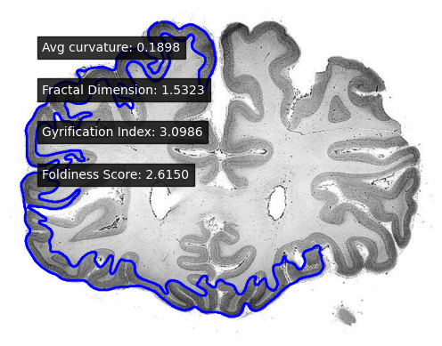

# Calculating the Foldiness Score of the Neural Cortex

## Setup Instructions

To run this project, make sure you have [Conda](https://docs.conda.io/en/latest/) installed. Then:

### 1. clone the repo 
```bash
git clone https://github.com/jacob-ellison/neural_foldiness
```

### 2. setup the env
```bash
conda env create -f environment.yml
conda activate nfoldy  
```

### 3. run the notebook

### Calculating the Foldiness Score of the Neural Cortex

We compute the **foldiness score** of the cerebral cortex as a composite metric based on three quantitative measures:

- **Fractal Dimension** $D_f$
- **Gyrification Index** $GI$
- **Mean Curvature** $\bar{H}$

These metrics capture complementary aspects of cortical folding and surface complexity.

## Input Segmentation

All calculations are performed on the **gray matter** mask of the cortex. Initially this mask is obtained via **Otsu’s multithresholding method**, which segments the image into multiple intensity-based classes, isolating the cortical gray matter. I have manually labelled the **gray matter** for a sample cortex and trained a lightweight machine learning model to segment gray matter based on image intensity and distance from the center.

## Component Metrics

1. **Fractal Dimension**  
   The fractal dimension $D_f$ quantifies the self-similarity and complexity of the cortical surface. It is estimated using box-counting or similar fractal analysis methods:

   $$D_f = \lim_{\epsilon \to 0} \frac{\log N(\epsilon)}{\log(1/\epsilon)}$$

   where $N(\epsilon)$ is the number of boxes of side length $\epsilon$ needed to cover the cortical surface.

2. **Gyrification Index (GI)**  
   In this 2D formulation, the gyrification index is defined as the ratio of the length of the actual cortex contour to the length of its convex hull:

   $$GI = \frac{L_{\text{cortex}}}{L_{\text{convex}}}$$

   where:
   - $L_{\text{cortex}}$ is the perimeter of the cortical contour (including sulci and gyri),
   - $L_{\text{convex}}$ is the perimeter of the convex hull enclosing the cortex.

   This gives a measure of cortical folding in a 2D coronal slice, with higher values indicating greater folding complexity.

3. **Mean Curvature**  
   We compute the mean curvature $\bar{H}$ from the outer contour of the gray matter mask. This is done by estimating the curvature at each point along the 2D contour using smoothed coordinate derivatives:

   $$\kappa(t) = \frac{x'(t)y''(t) - y'(t)x''(t)}{(x'(t)^2 + y'(t)^2)^{3/2}}$$

   where $x(t)$ and $y(t)$ are smoothed coordinates of the contour.

   The final metric is the **mean absolute curvature** over the entire contour:

   $$\bar{H} = \frac{1}{N} \sum_{i=1}^{N} |\kappa_i|$$

   This scalar value serves as a 2D approximation of cortical folding sharpness, with higher values indicating more local curvature.

## Foldiness Score

The final foldiness score $F$ is computed as a weighted combination of the above metrics:

$$F = w_1 D_f + w_2 GI + w_3 \bar{H}$$

where $w_1, w_2, w_3$ are user-defined or empirically determined weights depending on the importance assigned to each feature.


### Example calculation for human brain



